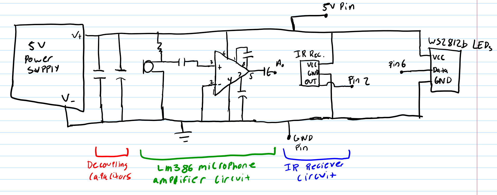
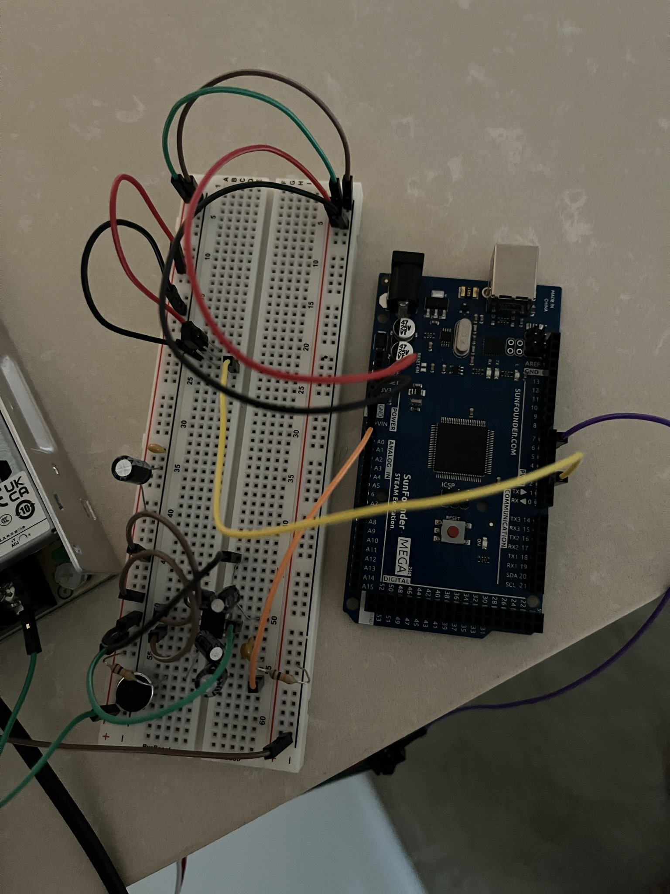
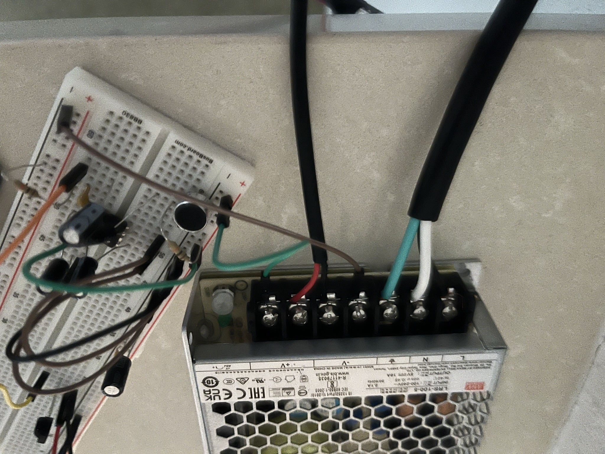
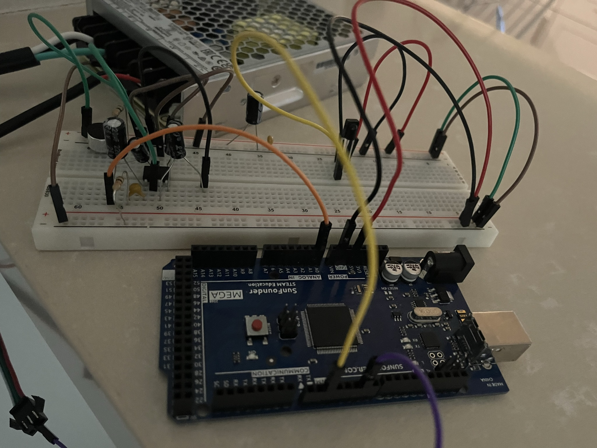

# Project Overview
This project utilizes an Arduino to control a strip of LED lights. The LED strip currently has 3 unique functions, but more can be easily added. An IR Remote is used to switch between functions. Below, the different functions and the circuitry is provided.     

## Functions       

***Music Visualizer:***    
A function driven by the FastFFT algorithm. This function requires an audio input, which is collected by the electret microphone which is then amplified via an audio amplifier circuit (schematic and circuit picute below). This is sampled 9800 times per second by the Arduino AnalogRead function, and the Fast Fourier Transform gets performed, splitting up the frequencies into 8 bands. From here, we can assign different tones to different RGB values, and make the lights change color and intensity based on noise.       Youtube videos of this with music below: 
- Sweet / I Thought You Wanted To Dance - Tyler, The Creator: https://youtu.be/JEkIoixdwwE
- I Think - Tyler, The Creator: https://youtu.be/NeurSqP53Og
- Are You Bored Yet? - Wallows ft. Clairo: https://youtu.be/GMEiVYNcs20      

***Rainbow Lighting:***    

Can be seen here: https://youtube.com/shorts/en_bQyjo1H4?feature=share          

***Solid Blinking Lights:***    
To be updated with videos later.          

## Remote Functionality        
Functionality of IR Remote tested here: https://youtube.com/shorts/WAq1vjUMgiA          

## Materials  
- Arduino Mega 2560
- 5 Meter WS2812b LED Strip
- 5V/18A Power Supply
- Generic Cord/Plug
- Electrical Tape
- Resistors/Capacitors/Breadboard/Jumper Wires
- IR Remote/Receiver
- Electret Microphone
- LM386      

## Schematic and Circuit Pictures     
         
Circuit:   
         
Connection to Power Supply:   
        
Connection to Arduino:    
         

